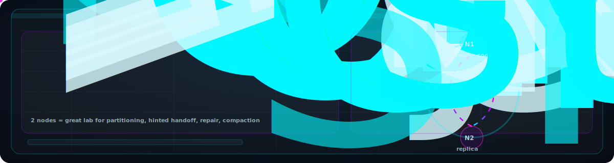

## Dashboard With Live Data
---

---
## Physical Setup

---

  

# Distributed Data Systems Demo with Apache Cassandra & 2 Raspberry Pis

## 📌 Overview
The goal of this project is to **demonstrate core distributed data systems principles** -  
**replication, fault tolerance, eventual consistency, and observability** - using a **minimal but realistic setup**.

Rather than relying on large cloud infrastructure, this system uses **two Raspberry Pis**, a real temperature sensor, a network switch to create a private network, and a production-grade NoSQL Distributed Database to show how **real-world distributed data systems behave under normal operation and failure conditions**.

---

##  Key Concepts Demonstrated
- Horizontal scaling using multiple nodes
- Data replication with Apache Cassandra
- Fault tolerance and node failure simulation
- Heartbeat-based node liveness detection
- Eventual consistency
- Nodes communicating via a local private network
- Separation of data plane (Cassandra) and control plane (heartbeats)
- Observability through a real-time dashboard

---

## System Architecture

### Components
- **Seed Node (Raspberry Pi 1)**  
  - Connected to a wired temperature sensor  
  - Acts as the initial Cassandra seed node  
  - Publishes sensor data to the backend REST API  

- **Peer Node (Raspberry Pi 2)**
  - Note: **Peer Node is not connected to any wired temperature sensor, only the Seed Node.**
  - Participates in Cassandra replication (published data from seed node to Cassandra, with a Replication Factor of 2(RF=2), Data is being replicated from the Seed Node to the Peer Node)  
  - Maintains a replica of the dataset  
  - Demonstrates resilience under node failures  

- **Apache Cassandra**  
  - Distributed, peer-to-peer NoSQL database  
  - Handles data replication across nodes and fault tolerance  

- **Spring Boot Backend (Java)**  
  - Exposes REST APIs  
  - Writes sensor data to Cassandra  
  - Reads replicated data for visualization  

- **Nextjs + Recharts + TypeScript**  
  - Real-time data visualization  
  - Polls backend APIs and display data on a dashboard

- **Network Switch**
  - [Why it's important!](https://drive.google.com/file/d/1nyTw7vZiWr7cqZHrakPgkuA5EpvmAGOU/view?usp=sharing)
  - Allows all machines (Raspberry Pi 1 & Raspberry Pi 2) to exist on the same Local Area Network (LAN) and talk to each other directly using IP addresses.
     

---

## 🔄 Data Flow
0. [Data Flow Explained](https://drive.google.com/file/d/1foO3VHvio_q6o-bxyRESVmyODTtUlEEl/view?usp=sharing)
1. Temperature sensor reads data on **Seed Node**
2. Spring Boot backend receives sensor data via REST API
3. Data is written to **Apache Cassandra**
4. Cassandra replicates data to the **Peer Node**
5. Dashboard fetches and visualizes data in real time
6. When a node goes down, replication and recovery behavior can be observed via the dashboard

---

##  Failure Scenarios Demonstrated
- Shutting down one Cassandra node (Physically unplugging the ethernet cable from the Raspberry PI)
- Observing continued read/write availability
- Watching replicas converge after node recovery
- Monitoring latency and data consistency during failures

---

## 🎤 Live Presentations
This project was presented as a **live lightning talk/demo** at:
- **Community Over Code 2025, Minneapolis, Minnesota.** [Watch Live Demo](https://drive.google.com/file/d/1OK0O4MZ8e3fC-Ypt53OT7S6pM7AChN_0/view?usp=sharing)

- **PyData Boston 2025** [Watch Live Project Demo](https://drive.google.com/file/d/1DSpj_jPg508O44Wc5viHnaGtwdEzTLC7/view?usp=sharing)

The demo showcased how **Distributed Data Systems behave under node failures**, using real hardware, real data, and real infrastructure components.

---

## Why This Project Matters
Most distributed data systems tutorials stop at “it works.”

This project goes further:
- It **expects failure**
- It **embraces imperfect networks**
- It shows how **production systems are designed to survive**, not avoid failure
- It demonstrates distributed data systems principles using **physical nodes** instead of virtual ones, helping a broader audience quickly understand it.

---

## Technologies/Hardware Used
- Apache Cassandra (distributed database)
- Java + lombok + Spring Boot (REST APIs)
- React/Nextjs + TypeScript (frontend dashboard)
- Recharts (temperature data visualization)
- HTML, TailwindCSS
- Raspberry Pi 4 (2 nodes)
- DS18B20 temperature sensor
- Docker & Docker Compose
- Python (sensor reader & heartbeat scripts)
- Network Switch & Ethernet cables

---

## System Architecture Diagram

---

## Takeaway
> Distributed Data Systems are not about avoiding failure;  
> They are about **continuing to function when failure is inevitable**.

